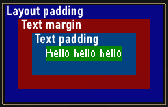

# EZGUI
### An xml & lua GUI framework for Noita, which lets you define your GUIs similarly like you would a web app with Vue.js
## Example:
You make an XML file that contains your GUI definition, just like single file components in Vue.js.
A root Layout element is mandatory.
```xml
<Layout>
  <Button @click="add_button_margin(5)">Click me!</Button>
  <Text forEach="element in collection">{{ element }}</Text>
</Layout>
<Style>
Layout {
  direction: vertical;
  padding: 2;
}
Layout > Button {
  margin: [button_margin]; // Can also databind to CSS properties!
}
</Style>
```
Then in your init.lua you can render this GUI:
```lua
-- Dofiling EZGUI.lua returns a table with an init function that you need to call and pass in the path to the library, which in turn will return a render function you can call to render a GUI
local render_gui = dofile_once("mods/your_mod_id/lib/EZGUI/EZGUI.lua").init("mods/your_mod_id/lib/EZGUI")
-- This is the data context table, here lives your data that you can bind to
local data = {
  collection = { "Bloo", "Blaa", "Blee" },
  button_margin = 5,
  -- Methods defined here can be used in @click, two variables will be available within these functions:
  -- 'self', refering to the data_context and
  -- 'element', the element that was clicked on
  add_button_margin = function(amount)
    print(element.name .. " was clicked!")
    self.button_margin = self.button_margin + amount
  end,
}

function OnWorldPreUpdate()
  -- render_gui(x, y, path_to_xml, data_context)
  render_gui(10, 50, "mods/EZGUI_example/gui.xml", data)
end
```
Currently only works in `init.lua`, since it needs access to `ModTextFileGetContent` to read the XML file.
I've also managed to make it work in the `settings.lua` by bundling up all the necessary files into the `settings.lua`, since `dofile`ing mod files does not work there, at least not in the main menu, because at that point the mod files are not yet loaded.

# Currently existing Elements:
## Layout
**The** element to handle layouting, can either layout child elements horizontally or vertically, depending on its CSS property `direction`.

## Button
A button with text that you can click and execute functions. The text is determined by it's contents, e.g: `<Button @click="do_something()">Click me!</Button>`
### Attributes:
- `@click`:function a function to call. It uses a primitive lua function parser and therefore only supports a syntax like this: `function_name('a string', 5)`

## Image
Render an image.
### Attributes:
- `src`:string - The path to the image file
- `scaleX`:number - Stretch the image on the x axis
- `scaleY`:number - Stretch the image on the y axis
## Slider
Render a slider.
### Attributes:
- `bind` - The data context variable to bind to
- `min`:number
- `max`:number
- `precision`:number - Number of digits to show after the decimal point
## Text
Render some text. Example `<Text>Hello</Text>`

## Input
For getting user input. Example `<Input bind="name"></Input>`
### Attributes:
- `bind` - The data context variable to bind to
- `max_length`:number - Maximum number of allowed characters
- `allowed_characters`:string - Example: 0123456789abcdefghijklmnopqrstuvwxyzABCDEFGHIJKLMNOPQRSTUVWXYZ

# Styling / Pseudo-CSS
The framework uses a custom implementation of CSS based solely on my own assumptions on how CSS works. It tries to mimic it without meeting any official specifications. Because it's custom made, it only implements a small subset of selectors and only a handful of properties. There are no IDs, only classes.
## Selectors that are available
- Element selector: `Layout`
- Class selector: `.classname`
- Ancestor selector: `Layout Button`
- Child selector: `Layout > Button`
- Universal selector: `Layout > *`

And of course you can combine them like: `Layout.classname > Button Text.otherclass`

Margin and padding should work just like the CSS Box Model https://www.w3schools.com/css/css_boxmodel.asp

There are also the CSS properties `width` and `height`, which only take effect if they're bigger than the elements calculated size.
Can be used to set the size of an element to a specific size, if the size is bigger than it's content, you can use `align_self_horizontal`
and `align_self_vertical` to align its content, kind of like `text-align` in real CSS, but also vertical.



There is also this reference/documentation here: [EZGUI Reference](https://TheHorscht.github.io/EZGUI)
